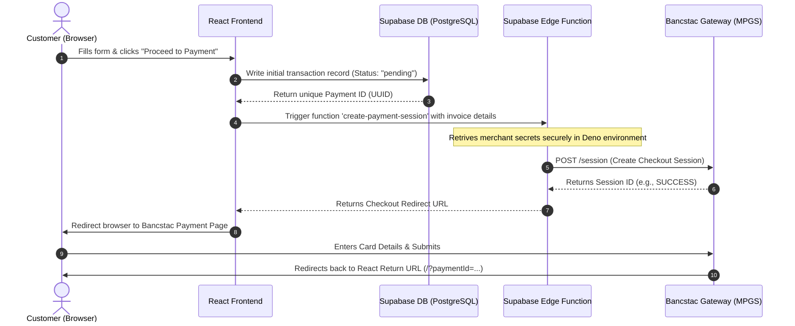

# Integration Report: React & Supabase with Bancstac Payment Gateway

This report documents the architecture, file structure, data flow, and setup instructions for the payment portal developed for **P W Holdings**. The solution utilizes **React** for a premium user interface, **Supabase** for database logging, and **Supabase Edge Functions** to securely bridge with the **Bancstac Internet Payment Gateway (IPG)**.

---

## 1. System Architecture

To ensure security, sensitive gateway credentials (such as API passwords and merchant IDs) are kept off the client side. The architecture coordinates three distinct layers:



---

## 2. File Directory & Component Details

Below are the files modified or created during this setup and their respective roles:

### Core Configuration Files

#### 1. [.env](file:///d:/Aaaa/P%20W%20Holdings/pay-app/.env)
* **Purpose**: Stores local React environment variables.
* **Contains**:
  * `VITE_SUPABASE_URL`: Your cloud Supabase project API endpoint.
  * `VITE_SUPABASE_ANON_KEY`: The public anonymous key used by the client application.

#### 2. [src/supabaseClient.ts](file:///d:/Aaaa/P%20W%20Holdings/pay-app/src/supabaseClient.ts) [NEW]
* **Purpose**: Instantiates the Supabase client connection using the credentials defined in the `.env` file.
* **Role**: Exposes the `supabase` object to allow database reads/writes and function invocations from React.

---

### React Frontend Interface

#### 3. [src/App.tsx](file:///d:/Aaaa/P%20W%20Holdings/pay-app/src/App.tsx) [MODIFIED]
* **Purpose**: Renders the checkout form user interface.
* **Key Features**:
  * Form inputs for **Invoice Number**, **Customer Name**, and **Payment Amount (LKR)**.
  * Interactive checkbox state for the **Terms and Conditions**.
  * Input validations (e.g., ensuring all fields are complete, validating positive amounts).
  * Triggers the database logging and calls the secure Edge Function.
  * Handles redirection to the secure checkout page.

#### 4. [src/App.css](file:///d:/Aaaa/P%20W%20Holdings/pay-app/src/App.css) [MODIFIED]
* **Purpose**: Implements the layout styling.
* **Design Aesthetic**:
  * Modern, premium **glassmorphism card** container.
  * Dark mode theme utilizing a tailored HSL dark blue-to-indigo gradient background (`#0f172a` to `#1e1b4b`).
  * Custom Google Font integration (**Outfit**) to bypass default browser typography.
  * Glowing hover transitions for form inputs and the submit button.
  * Embedded CSS keyframe animations (`fadeIn` and spinning loader).

---

### Secure Deno Backend (Edge Functions)

#### 5. [supabase/functions/create-payment-session/index.ts](file:///d:/Aaaa/P%20W%20Holdings/pay-app/supabase/functions/create-payment-session/index.ts) [NEW]
* **Purpose**: Serverless endpoint executing on Supabase's Edge Network (Deno).
* **Role**:
  * Securely fetches merchant keys (`BANCSTAC_MERCHANT_ID`, `BANCSTAC_API_PASSWORD`) from Supabase Secrets.
  * Constructs the authorization headers (`Basic Auth`) and formats the request body according to the Bancstac/MPGS API standard.
  * Dispatches an HTTPS POST request to the Bancstac session endpoint.
  * Receives the unique `session.id` and returns the generated payment checkout link back to the browser.

---

## 3. Data & Connection Flows

### How Supabase Connects to React
1. On runtime load, [src/supabaseClient.ts](file:///d:/Aaaa/P%20W%20Holdings/pay-app/src/supabaseClient.ts) reads `import.meta.env.VITE_SUPABASE_URL` and `import.meta.env.VITE_SUPABASE_ANON_KEY`.
2. It executes `createClient()` which initializes the WebSocket and REST endpoints configured under the hood of `@supabase/supabase-js`.
3. Every request sent from React automatically appends the `apikey` headers to satisfy Supabase API Gateways.

### How Invoice Details Go to the Database
When the customer clicks **Proceed to Payment**:
1. React collects the text inputs from the React `useState` hooks: `invoiceNo`, `name`, `amount`.
2. It calls the Supabase DB client:
   ```typescript
   await supabase.from('payments').insert([{ invoice_no, customer_name, amount, status: 'pending' }])
   ```
3. Supabase checks the **Row Level Security (RLS)** policy:
   * The policy `"Allow public payment submission"` permits any client application to insert a transaction.
4. The database registers the record, auto-generates a unique `id` (UUID), and returns it back to the client (`.select().single()`).

### How the Payment Session is Created
1. React invokes the Edge Function using the returned database row ID (`dbData.id`):
   ```typescript
   await supabase.functions.invoke('create-payment-session', { body: { paymentId, invoiceNo, name, amount } })
   ```
2. The Edge Function runs on the cloud, reads the private bank secrets (using `Deno.env.get()`), and queries the Bancstac IPG servers.
3. Once the gateway provides the session, the Edge Function returns the target redirect URL to the React app:
   ```typescript
   window.location.href = data.redirectUrl;
   ```

---

## 4. Production Release Checklist

To move from the testing sandbox to a live production environment:

1. **Obtain Production Credentials**: Get the live Production Merchant ID, API Password, and Gateway Endpoint from your acquiring bank.
2. **Update Edge Secrets**: Update your secrets on the Supabase dashboard or via CLI:
   ```bash
   npx supabase secrets set BANCSTAC_MERCHANT_ID="live_merchant_id"
   npx supabase secrets set BANCSTAC_API_PASSWORD="live_api_password"
   npx supabase secrets set BANCSTAC_GATEWAY_URL="https://live-gateway.bancstac.com/api/rest/version/72"
   npx supabase secrets set BANCSTAC_CHECKOUT_BASE_URL="https://live-gateway.bancstac.com"
   ```
3. **Database Security Audit**: Ensure that only trusted accounts can update transaction statuses. Make sure RLS is enabled on your tables.
